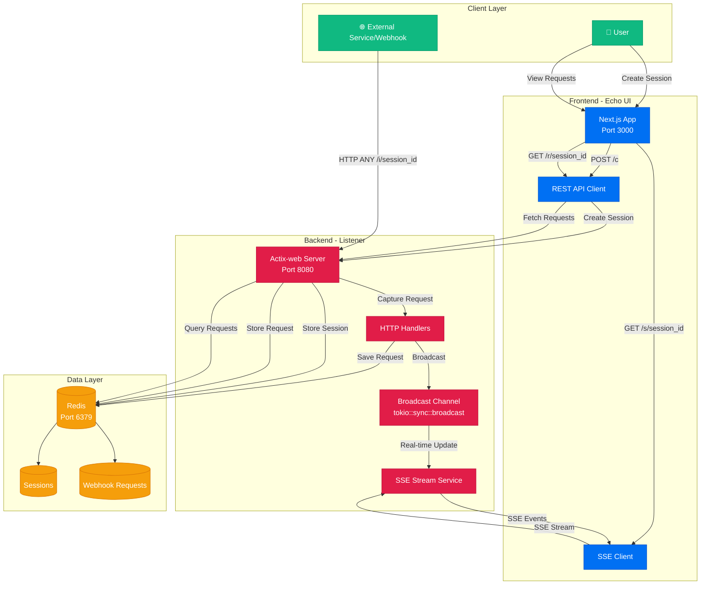

# EchoHook

A real-time webhook testing and inspection tool that allows developers to create temporary endpoints for testing webhook integrations. The system captures and displays all incoming HTTP requests with full details.

## Architecture

- **Backend**: Rust with Actix-web framework (production-grade, modular design)
- **Frontend**: Next.js (React) with TypeScript
- **Database**: Redis for temporary data persistence
- **Protocol**: Server-Sent Events (SSE) for real-time updates

### Architecture Diagram



### Component Interactions

1. **Session Creation Flow**:
   - User clicks "Create Session" → Frontend calls `POST /c`
   - Backend generates UUIDv7 session ID → Stores in Redis with TTL
   - Returns session metadata (ingestion URL, stream URL, etc.)

2. **Webhook Ingestion Flow**:
   - External service sends HTTP request to `/i/{session_id}`
   - Backend validates session, captures request details
   - Stores request in Redis (Hash + Sorted Set for indexing)
   - Broadcasts request via in-memory channel for real-time delivery

3. **Real-time Updates Flow**:
   - Frontend establishes SSE connection to `/s/{session_id}`
   - Backend subscribes to broadcast channel for that session
   - When new request arrives, it's immediately pushed via SSE
   - Frontend receives and displays request in real-time

4. **Historical Requests Flow**:
   - Frontend fetches paginated requests via `GET /r/{session_id}`
   - Backend queries Redis sorted set for request IDs
   - Retrieves full request data from Redis hashes
   - Returns JSON array of requests

## Features

- ✅ Real-time webhook capture via SSE (using in-memory broadcast channels)
- ✅ Full request inspection (headers, body, metadata)
- ✅ Session management with configurable expiration
- ✅ Rate limiting (max requests per session)
- ✅ Request filtering and search
- ✅ JSON pretty-printing
- ✅ Copy-to-clipboard functionality
- ✅ Recent sessions history (localStorage)
- ✅ Responsive design with dark mode support
- ✅ Structured logging with tracing
- ✅ Graceful error handling
- ✅ CORS configuration

### Key Design Decisions

1. **Modular Structure**: Separated concerns into distinct modules
2. **Error Handling**: Custom error types with proper HTTP responses
3. **Logging**: Structured logging with `tracing` crate
4. **Configuration**: Environment-based configuration
5. **SSE**: Uses `tokio::sync::broadcast` for efficient real-time updates
6. **Connection Pooling**: Multiplexed Redis connections

## Prerequisites

- [Bun](https://bun.sh) (for frontend)
- [Rust](https://rustup.rs) (for backend)
- [Redis](https://redis.io) (running locally or remotely)

## Quick Start

### 1. Start Redis

```bash
# Using Docker
docker run -d -p 6379:6379 redis:latest

# Or using local Redis
redis-server
```

### 2. Run the Backend

```bash
cd packages/listener
cargo run --release
```

### 3. Run the Frontend

```bash
cd apps/echo-ui
bun install
bun run dev
```

## Configuration

### Backend Environment Variables

| Variable | Default | Description |
|----------|---------|-------------|
| `REDIS_URL` | `redis://localhost:6379` | Redis connection URL |
| `SERVER_HOST` | `0.0.0.0` | Server bind address |
| `SERVER_PORT` | `8080` | Server port |
| `LISTEN_URL` | `http://localhost:8080` | Public URL for webhook ingestion |
| `SESSION_TTL` | `10800` | Session TTL in seconds (3 hours) |
| `MAX_BODY_SIZE` | `10485760` | Maximum request body size (10 MB) |
| `MAX_REQUESTS_PER_SESSION` | `1000` | Maximum requests per session |
| `CORS_ALLOWED_ORIGINS` | `*` | Comma-separated allowed origins |
| `REDIS_POOL_SIZE` | `10` | Redis connection pool size |
| `RUST_LOG` | `info` | Log level (trace, debug, info, warn, error) |

### Frontend Environment Variables

| Variable | Default | Description |
|----------|---------|-------------|
| `NEXT_PUBLIC_API_URL` | `http://localhost:8080` | Backend API URL |

## API Endpoints

### Create Session
```
POST /c
Response: 201 Created
```

### Webhook Ingestion
```
ANY /i/{session_id}
ANY /i/{session_id}/{path}
Response: 200 OK
```

### Stream Requests (SSE)
```
GET /s/{session_id}
Content-Type: text/event-stream
```

### Fetch Historical Requests
```
GET /r/{session_id}?limit=100&offset=0
Response: 200 OK
```

### Health Check
```
GET /health
Response: 200 OK
```

## Usage

1. **Create a Session**: Visit `http://localhost:3000` and click "Create New Session"
2. **Get Webhook URL**: Copy the webhook URL provided for your session
3. **Send Requests**: Send HTTP requests to the webhook URL from any source
4. **View Requests**: See all captured requests in real-time on the session page
5. **Inspect Details**: Click on any request to view headers, body, and raw data

## Development

### Backend

```bash
cd packages/listener

# Run with hot reload (using cargo-watch)
cargo watch -x run

# Run tests
cargo test

# Build for production
cargo build --release

# Check for issues
cargo clippy
```

### Frontend

```bash
cd apps/echo-ui

# Development
bun run dev

# Build
bun run build

# Lint
bun run lint
```

## Performance

The backend is designed for high performance:

- **Multiplexed Redis connections**: Single connection handles multiple requests
- **In-memory SSE broadcasting**: Uses `tokio::sync::broadcast` instead of Redis pub/sub for lower latency
- **Async/await throughout**: Non-blocking I/O
- **Release profile optimization**: LTO enabled, single codegen unit

## Production Deployment

### Docker (recommended)

```dockerfile
# Backend Dockerfile
FROM rust:1.75 as builder
WORKDIR /app
COPY . .
RUN cargo build --release

FROM debian:bookworm-slim
RUN apt-get update && apt-get install -y ca-certificates && rm -rf /var/lib/apt/lists/*
COPY --from=builder /app/target/release/listener /usr/local/bin/
CMD ["listener"]
```

### Environment Variables for Production

```bash
REDIS_URL=redis://your-redis-host:6379
LISTEN_URL=https://your-domain.com
CORS_ALLOWED_ORIGINS=https://your-frontend.com
RUST_LOG=info
```

## License

[MIT](LICENSE)
